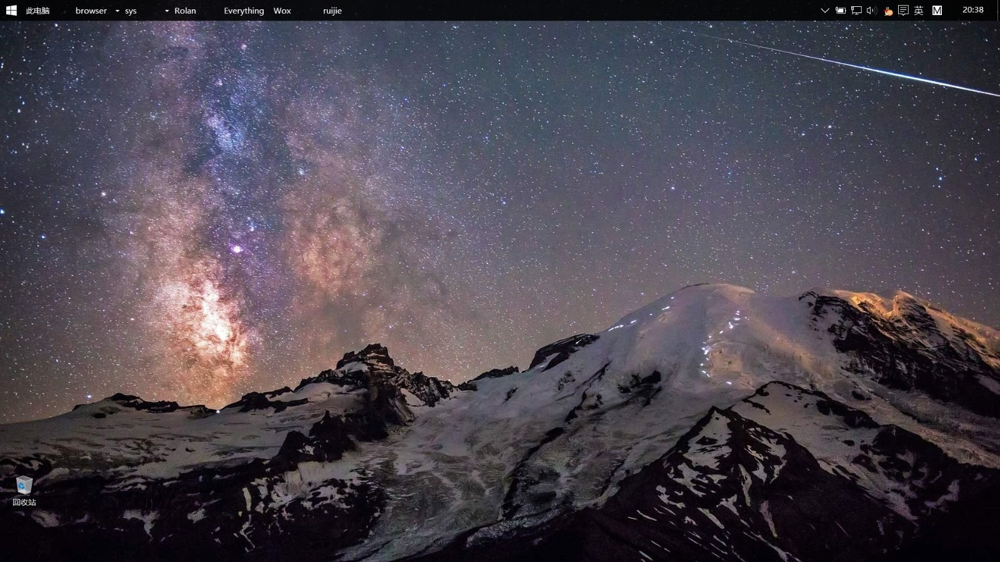

#   desktop manager

##  先放图

##  配置

|软件|来源|作用|
|------------|-------|-----|  
|truelaunchbar|<a href="http://tieba.baidu.com/f/good?          kw=truelaunchbar">truelaunchbar吧|负责任务栏方面|
|rolan|<a href="https://getrolan.com/">rolan官网|工具启动箱|  
|everything|<a href="https://www.voidtools.com/">voidtools|快速查找工具|
|wox|<a href="http://www.wox.one/">wox官网|辅助rolan|

---
有机会出个truelaunchbar的教程吧……
